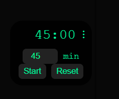

# Pomodoro Timer ⏱️

A beautiful, always-on-top Pomodoro timer that helps you stay focused and productive.





## 🚀 Quick Start

### 📥 Easy Installation (Recommended)

1. **[Download Latest Release](https://github.com/HarshaLakkaraju/minimal_pomodoro/releases)**
2. Run `Minimal Pomodoro Setup.exe`
3. Follow the installation wizard
4. Launch from Start Menu

💡 **No installation needed?** Try the [portable version](https://github.com/HarshaLakkaraju/minimal_pomodoro/releases)!

---

### 👨‍💻 Developer Installation (Run from Source)

1. Clone the repo:

   ```bash
   git clone https://github.com/HarshaLakkaraju/minimal_pomodoro.git
   cd minimal_pomodoro
   ```

2. Install dependencies:

   ```bash
   npm install
   ```

3. Start the app:

   ```bash
   npm start
   ```

---


## ✨ Features

* 🎯 **Always on top** – Stays visible over other windows
* ⌨️ **Keyboard controlled** – Full control without mouse
* 🔄 **Auto-updates** – Always have the latest version
* 🎨 **Minimal design** – Clean and distraction-free
* 🔔 **Smart notifications** – Visual and sound alerts
* ⚡ **Lightweight** – Uses minimal system resources


## ⌨️ Keyboard Shortcuts

| Key | Action |
|-----|--------|
| `Space` | Start/Pause timer |
| `R` | Reset timer |
| `M` | Show/hide settings |
| `C` | Cycle durations (25⏵45⏵60⏵90min) |
| `S` | Stop alarm sound |

## 🔄 Auto-Updates

The app automatically checks for updates and installs them seamlessly. You'll get a notification when updates are available.

## 🤝 Support

- **Bug Reports**: [Create an issue](https://github.com/HarshaLakkaraju/minimal_pomodoro/issues)
- **Feature Requests**: [Suggest an improvement](https://github.com/HarshaLakkaraju/minimal_pomodoro/issues)
- **Questions**: Check [documentation](docs/) first

## 🛠️ For Developers

[See development documentation](docs)

## 📄 License

MIT License - see [LICENSE](LICENSE) file for details.

---

**Happy focusing!** 🍅
